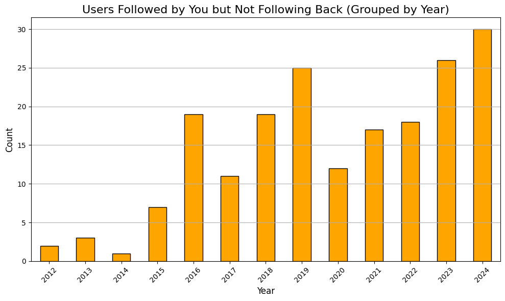

# Instagram-Followers
Project to catch followers who do not follow back on Instagram

The project will be performed through downloaded data from Instagram:

1. Through data download request through Instagram. The downside is the wait for the company to send the desired information.

Instagram Data Analysis Visualizations:
1. Number of followers: 1074
2. Number of following: 1026

A total of 238 followers that I do not follow back and a total of 190 accounts I follow but they don't follow me back. There is a total of 1074 followers compared to 1026 accounts I follow. The analysis provides a comprehensive overview of your Instagram engagement, focusing on mutual and non-reciprocal follows, follower growth, and the dynamics over the years.

followers you don't follow back:

From the pie chart we can see the percentage of users who follow you but you don't follow back. 22.2% of users follow you but you don't follow back and 77.8% of users you follow back.

A steady increase of accounts you follow but they don't follow you back. Year 2024 has the highest number of accounts you follow but they don't follow you back with over 30 accounts.

A filtered Pie chart showing only accounts not following you back after 2019 and which year had the highest number of accounts not following you back.

81.5% of users you follow but they don't follow you total years. 18.5% of users follow you back total years.

This visualization, titled "Cumulative Non-Reciprocal Follows Over Time," effectively shows how the count of people you follow who don't follow you back has increased over the years. The following insights can be drawn from this chart:

1. Steady Growth: There is a gradual but consistent increase in non-reciprocal follows over time. This suggests that as your social circle grew, the number of people who didn’t follow you back also increased steadily.

2. Key Growth Periods:

    You might notice periods where the growth is faster, potentially indicating times when you followed more users without receiving reciprocal follows. This could correlate with specific activities, like participating in events or expanding social reach during certain years.\
3. Long-Term Trends:

    The steady growth over the years could also point to typical behavior on platforms like Instagram, where users may follow others for updates or content without expecting a reciprocal follow.\
4. Cumulative Impact:

    The cumulative count reaching close to 200 by 2024 emphasizes the importance of regularly reviewing your connections if you're keen on optimizing mutual engagement.

From the bar chart, the years with most growth were between 2018 and 2019. The year with the most growth was 2019. 2019 had over 175 new followers, while 2018 had over 150 new followers.

This graph represents the yearly follower growth rate in percentage, providing insight into how your Instagram following has changed over time. Here's what can be inferred from it:

Observations:\
Spike in 2016:

There is a significant growth rate above 250% in 2016, which could indicate a major event, campaign, or content that resonated well with your audience that year.\
Fluctuating Growth:

The growth rate alternates between positive and negative in some years, showing variability in follower dynamics. Negative values could suggest periods of decreased engagement or people unfollowing your account.\
Recent Stability:

From 2023 to 2024, the growth rate appears consistent and positive, suggesting sustained efforts to maintain or grow your audience.\
Periods of Decline:

Years like 2014, 2020, and 2022 show negative growth, indicating more followers were lost than gained during those times.

# Conclusion
A total of 238 followers that I do not follow back and a total of 190 accounts I follow but they don't follow me back. There is a total of 1074 followers compared to 1026 accounts I follow. The analysis provides a comprehensive overview of your Instagram engagement, focusing on mutual and non-reciprocal follows, follower growth, and the dynamics over the years.

The analysis provides a comprehensive overview of your Instagram engagement, focusing on mutual and non-reciprocal follows, follower growth, and the dynamics over the years.

1. Non-Reciprocal Follows:\
A significant proportion (22.2%) of followers don't receive a follow-back from you, suggesting opportunities to engage more with your audience.\
On the flip side, 81.5% of the people you follow don't follow you back, highlighting the potential for selective following or assessing the value of these connections.

2. Cumulative Growth:\
The cumulative chart shows steady growth in non-reciprocal follows, with noticeable spikes during certain periods. This could correlate with major personal milestones or platform activity trends.

3. Follower Growth:\
The years 2018 and 2019 saw the highest follower growth, potentially indicating periods of increased activity or successful content strategies.\
The significant growth rate in 2016 suggests a major event or campaign that resonated with your audience. In contrast, periods of negative growth in 2014, 2020, and 2022 indicate times where followers were lost, possibly due to changes in activity or audience interest.

4. Recent Trends:\
The follower growth rate has stabilized in recent years, suggesting consistency in content or engagement strategies.

5. Non-Reciprocal Distribution:\
From 2019 onwards, a gradual increase in non-reciprocal follows is observed, with 2024 being the highest year.

# Recommendations
1. Engagement Strategies:\
Identify and engage with the 22.2% of followers you don't follow back if they align with your goals or interests.\
Reassess the 81.5% of non-reciprocal follows. Unfollow users who no longer provide value to declutter your feed and focus on meaningful connections.

2. Content Optimization:\
Review the strategies or content that drove significant growth in 2016, 2018, and 2019, and attempt to replicate or adapt these for future engagement.\

3. Stabilize Declines:\
Investigate reasons for the negative growth in 2014, 2020, and 2022. Consider revamping content strategies or re-engaging with your audience during similar periods.\

4. Focus on Reciprocity:\
Use the insights to encourage mutual engagement, perhaps by directly interacting with followers or creating content that resonates more with those you follow.\

5. Track and Adapt:\
Continue monitoring yearly growth and cumulative trends to adapt strategies. Highlight any personal milestones or content shifts during periods of significant change for better contextual understanding.
